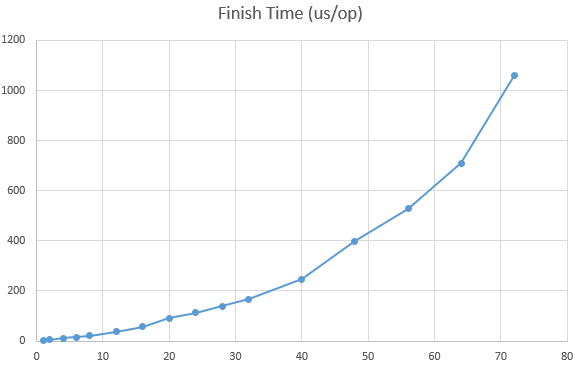
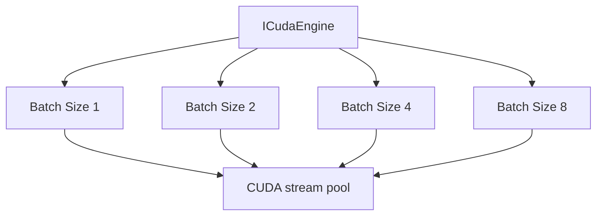
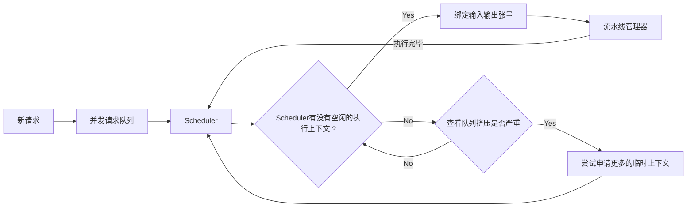

# 基于TensorRT的推理服务框架

## 特性
### 1. 显存池
模块见`src/memory`。仿照`tcmalloc`，采用`Thread Cache`、`Center Cache`、`Page Cache`三级缓存，复用显存，并尽可能避免锁的使用。测试代码见`benchmark/unit_test_for_gmp.cu`

- 单线程条件下，在小显存频繁分配释放的场合，小显存(小于等于`1MB`)`allocate` + `deallocate`平均用时小于`cudaMalloc` + `cudaFree`的`1%`，不同尺寸下，两者的用时比较如下(单位：`us/op`)：

| 分配大小 | 显存池 | 原生API | 
| :------- | :-----: | -------: |
| 64B | 1.52961 | 168.475 | 
| 128B| 1.45432 | 170.337 |
| 256B | 1.42729 | 181.187 |
| 512B | 1.43791 | 176.625 |
| 1KB | 1.45505 | 186.587 |
| 2KB | 1.45269 | 175.104 |
| 4KB | 1.47208 | 175.488 |
| 8KB | 1.43948 | 184.302 |
| 16KB | 1.58647 | 180.08 |
| 32KB | 1.77524 | 183.431 |
| 64KB | 1.43306 | 186.109 |
| 128KB | 1.51140 | 176.924 |
| 256KB | 1.46174 | 180.687 |
| 512KB | 1.42189 | 177.583 |
| 1MB | 1.55411 | 184.895 |

- 在我的i5-13600KF CPU上，14核20线程，设定Page Cache显存上限为`4GB`，进行多线程并发测试，每次分配/释放大小为256B ~ 8KB中按顺序递增的值，由于每次为Thread Local分配一个Batch时，会触发Center Cache的资源竞争，因此会触发锁，随着线程数量变多，单次操作的耗时也会变多。此外当并发线程变多时，进行碎片整理的耗时占比也会增加，因此随着线程增加，分配时间显著增加。但总体来看，并发线程小于10时，分配/释放的时间稳定在30us/op以下。测试结果如下：

### 2. TensorRT异步流水线和动态批处理
对于一个模型engine，为它创建了若干个不同批处理大小的执行上下文，并基于实际的请求队列大小确定合适的`batch_size`。此外，`CudaStream`池里面会具有若干创建好的具有不同优先度的流，具体的个数通过Nsight system测试得到

由于执行上下文在异步执行时，它绑定输入输出张量不得发生变化，每接收到一个请求，如果直接让它绑定对应的执行上下文，如果该执行上下文尚未异步操作完成，那么此时该请求不得不阻塞，或者选择去`clone`这个执行上下文，无论哪一个选择都会造成一定的性能损失。

我的做法是**动态批处理**：如果对应`batch_size`的执行上下文尚未完成，该请求会堆积。有时会和后来的请求一起，作为请求集合送入到更大`batch_size`的执行上下文中。如果推理请求过多，执行上下文将不得不执行`clone`，在`clone`时优先选择大`batch_size`以快速清除请求队列。此外，**动态批处理**还可以

